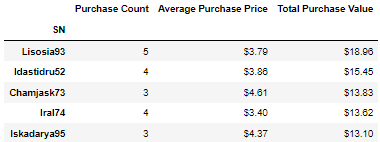

## Background: Heroes of Pymoli

  

After a lot of hard work in the data wrangling mines, I've landed a job as Lead Analyst for an independent gaming company. I've been assigned the task of analyzing the [data](HeroesOfPymoli/Resources/purchase_data.csv) for their most recent fantasy game, Heroes of Pymoli.

Like many others in its genre, the game is free-to-play, but players are encouraged to purchase optional items that enhance their playing experience. As a first task, I will generate a report that breaks down the game's purchasing data into meaningful insights.

My final report will include each of the following:

### Player Count
  * Total Number of Players 
  

### Purchasing Analysis (Total)
  * Number of Unique Items
  * Average Purchase Price
  * Total Number of Purchases
  * Total Revenue 
  

### Gender Demographics
  * Percentage and Count of Male Players
  * Percentage and Count of Female Players
  * Percentage and Count of Other / Non-Disclosed 
  

### Purchasing Analysis by gender
  * Purchase Count
  * Average Purchase Price
  * Total Purchase Value
  * Average Purchase Total per Person by Gender 
  

### Age Demographics (4 year bins)
  * Purchase Count
  * Average Purchase Total per Person by Age Group 
  

### Top 5 Spenders by Total Purchase Value
  * SN
  * Purchase Count
  * Average Purchase Price
  * Total Purchase Value 
  

### 5 Most Popular Items by Purchase Count
  * Item ID
  * Item Name
  * Purchase Count
  * Item Price
  * Total Purchase Value 
  

### 5 Most Profitable Items by Total Purchase Value
  * Item ID
  * Item Name
  * Purchase Count
  * Item Price
  * Total Purchase Value
  

  - - -

### Written Report
  * The average price of total purchases is $3.05.
  * The majority of the players who are purchasing items are male at approximately 84%.
  * Male average purchase price is below the average price at $3.02.
  * Most percentage of players are between the ages of 20-24 at approximately 45%.
  * Players between the ages of 35-39 spend more on average than other age groups at $3.60.
  * “Final Critic” was purchased the most at 13 times.

  - - - 

## References

Mockaroo, LLC. (2021). Realistic Data Generator. [https://www.mockaroo.com/](https://www.mockaroo.com/)

  - - -

Contact Information:
* [LinkedIn](https://www.linkedin.com/in/DConnellyII)
* Darryl.Connelly.II@gmail.com